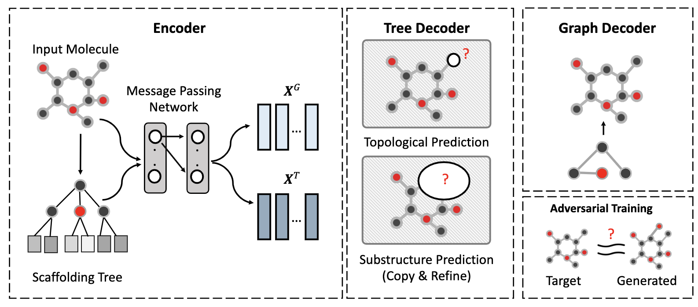

# CORE: Automatic Molecule Optimization using Copy and Refine Strategy (AAAI 2020)

Molecule optimization is about generating molecule Y with more desirable properties based on an input molecule X. The state-of-the-art approaches partition the molecules into a large set of substructures S and grow the new molecule structure by iteratively predicting which substructure from S to add. However, since the set of available substructures S is large, such an
iterative prediction task is often inaccurate, especially for substructures that are infrequent in the training data. To address this challenge, we propose a new generating strategy called
“Copy and Refine” (CORE), where at each step the generator first decides whether to copy an existing substructure from input X or to generate a new substructure, then the most promising substructure will be added to the new molecule. Combining together with scaffolding tree generation and adversarial training, CORE can significantly improve several latest molecule optimization methods in various measures including drug-likeness (QED), dopamine receptor (DRD2), and penalized LogP.
We tested CORE and baselines using the ZINC database and CORE obtained up to 11% and 21% relative improvement over the baselines on success rate on the complete test set and
the subset with infrequent substructures, respectively.

## Requirements (Following Graph2Graph)
* Python == 2.7
* RDKit >= 2017.09
* PyTorch >= 0.4.0
* Numpy
* scikit-learn

The code has been tested under python 2.7 with pytorch 0.4.1. 

## Quick Start (Following Graph2Graph)
The tutorial of training and testing our variational junction tree encoder-decoder is in [diff_vae/README.md](./diff_vae).

A quick summary of different folders:
* `data/` contains the training, validation and test set of logP, QED and DRD2 tasks described in the paper.
* `fast_jtnn/` contains the implementation of junction tree encoder-decoder.
* `diff_vae/` includes the training and decoding script of variational junction tree encoder-decoder ([README](./diff_vae)).
* `diff_vae_gan/` includes the training and decoding script of adversarial training module ([README](./diff_vae_gan)).
* `props/` is the property evaluation module, including penalized logP, QED and DRD2 property calculation.
* `scripts/` provides evaluation and data preprocessing scripts.

## Implementation of CORE

* `fast_jtnn/xxx.py` 

This repo is adapted from [Graph2Graph](https://github.com/wengong-jin/iclr19-graph2graph). 

## Contact
Tianfan Fu (futianfan@gmail.com)

